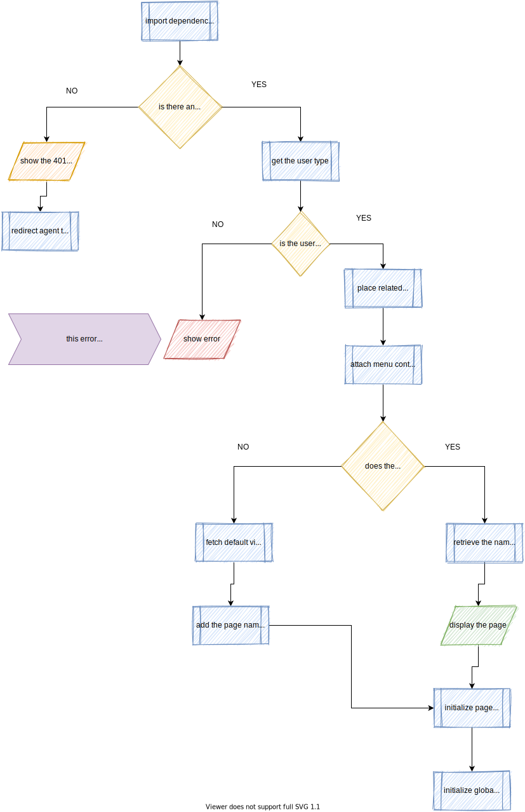
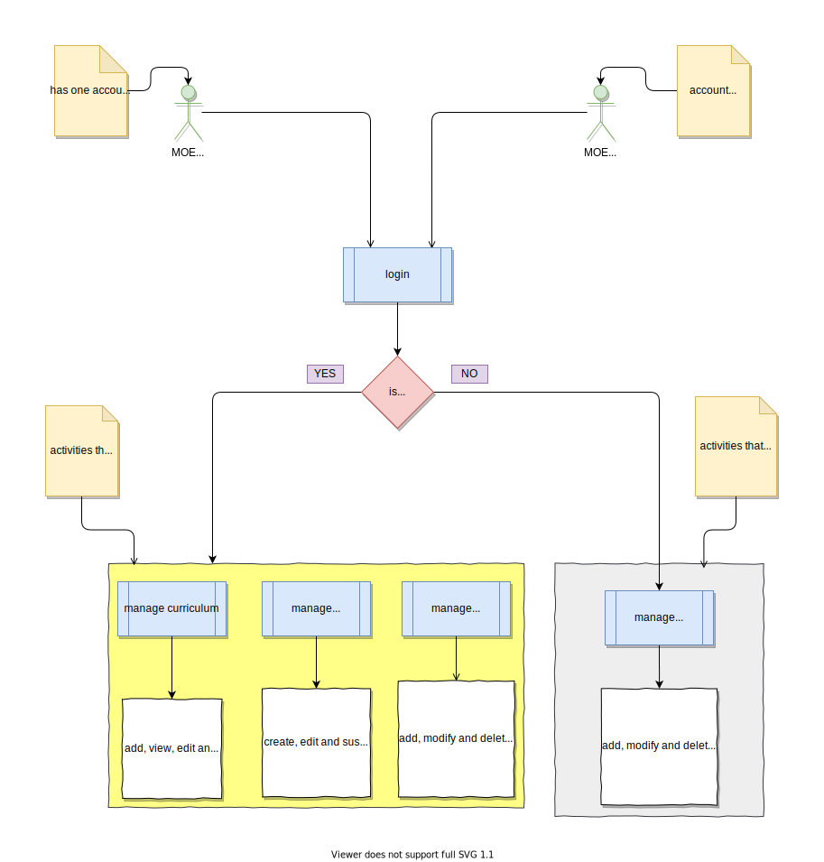

<!--  -->
# Project ATLAS (schoolmass_eLearning)
<!--  -->
> This documentation details the structure, architecture, contribution polices and best practice for the *__ATLAS project__*, An online eLearning platform developed at Tamma Corporation. This document does not include a GUI backend consumption reference manual for front-end developers. for that visit: [GUI backend consumption reference doc](https://documenter.getpostman.com/view/5793469/Szmb6zcW)

## Table of Content
* Project Version
* Purpose
* Workspace
<!-- * Educator Process Flow
   * Login Process 
   * User Management Process 
   * Curriculum Management Process 
   * Academic Management Process 
* Student Process Flow
    * Account Creation Process 
    * Login Process 
    * View Curriculum Process 
    * View Task Process 
    * Take Test Process 
    * Ask Question Process 
    * Read Question Reply Process 
* Feedback Process Flow
* Project Contributors  -->

## Project Version
| Date      | Version |
| ----      | --      |
| 4/29/2020 |   1.0.0    |

## Purpose
This document provides a comprehensive architectural overview of the system, using a number of different architectural views to depict different aspects of the system. It is intended to capture and convey the significant architectural decisions which have been made on the system.

## login Process Flow

## Workspace Process Flow

## Academic setup Process Flow

<!-- 
## Educator Process Flow

### Login Process 
<ul>
    <li><b>Handled By:</b>
        <ul>
            <li>class: educator_Login.class.php</li>
            <li></li>
            <li></li>
            <li></li>
            <li></li>
        </ul>
    </li>
    <li></li>
</ul>

### User Management Process 
### Curriculum Management Process 
### Academic Management Process 

## Student Process Flow

### Account Creation Process 
### Login Process 
### View Curriculum Process 
### View Task Process 
### Take Test Process 
### Ask Question Process 
### Read Question Reply Process

## Feedback Process Flow

  -->

## Contributors

